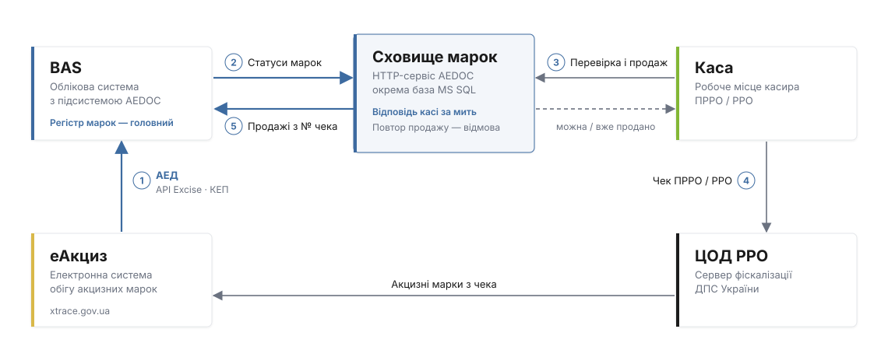

# HTTP-сервіс «Сховище марок» для ПРРО

В розробці

Основна мета сервісу — постійно підтримувати актуальне сховище акцизних марок для ПРРО і РРО. Облікова система передає в нього кожну зміну статусу марки, каса за мить перевіряє марку перед продажем, а продажі автоматично повертаються в облік з номером чека.

Сервіс — частина Windows-служби **AEDocSignService**; дані зберігаються в окремій базі MS SQL.

## Схема роботи

1. **Статуси з еАкциз.** Документи АЕД, сканування упаковок і переміщення змінюють статус марки в обліковій системі.
2. **Передача в сховище.** Облікова система одразу передає зміни в сховище марок. Коли змін немає, вона однаково повідомляє, що дані актуальні.
3. **Перевірка на касі.** Каса сканує марку, отримує відповідь «можна» або «вже продано» і фіксує продаж.
4. **Чек ПРРО / РРО.** Чек з марками йде на сервер фіскалізації ДПС, звідти марки потрапляють в еАкциз.
5. **Продажі в облік.** Облікова система забирає продажі: марка отримує статус «Погашено ЕМ» з номером чека.

## Для кого

Для магазинів і мереж, які продають алкоголь або тютюн з акцизними марками, ведуть облік з підсистемою AEDOC і пробивають чеки через ПРРО або РРО. Особливо корисно, якщо:

- на точці кілька кас або каса працює на окремому комп'ютері;
- каса не повинна зупинятися, коли облікова система оновлюється чи зайнята обміном з еАкциз;
- важливо виключити повторний продаж однієї марки на різних касах.

## Основні переваги

<strong>Перевірка марки за мить</strong>
Каса сканує марку і одразу бачить, чи можна її продати. Без очікування облікової системи і без запитів до еАкциз.

<strong>Немає подвійних продажів</strong>
Щойно марку продано, сховище це фіксує. Спроба пробити її ще раз — на цій чи іншій касі — отримає відмову з номером першого чека.

<strong>Жоден продаж не губиться</strong>
Кожен продаж повертається в облікову систему з номером чека. Поки облік не підтвердив запис, продаж чекає в черзі сховища.

<strong>Каса не залежить від облікової системи</strong>
Оновлення, перезапуск чи важкий обмін з еАкциз в обліковій системі не зупиняють продажі.

<strong>Завжди видно, чи дані свіжі</strong>
Облікова система постійно повідомляє сховище, що дані актуальні. Якщо зв'язок зник, каса отримує попередження «дані застарілі».

<strong>Кілька ПРРО — одні дані</strong>
Усі ПРРО магазину звертаються до одного сховища і бачать однаковий статус марки. Доступ — лише з токеном.

## Підключення і перехід

Облікова система переходить на роботу зі сховищем через **майстер міграції**: він вивантажує всі марки в сховище, звіряє дані і лише після успішної перевірки дозволяє касам продавати через сервіс. Зворотний перехід — тим самим майстром: продажі з кас забираються в облік, файли повертаються в основну базу.

<a class="promo" href="rozrobnykam/">
Для розробників
<strong>API для касового ПЗ (ПРРО / РРО)</strong>
Перевірка марки, пакетна перевірка, фіксація продажу, коди відповідей і налаштування служби.
</a>
